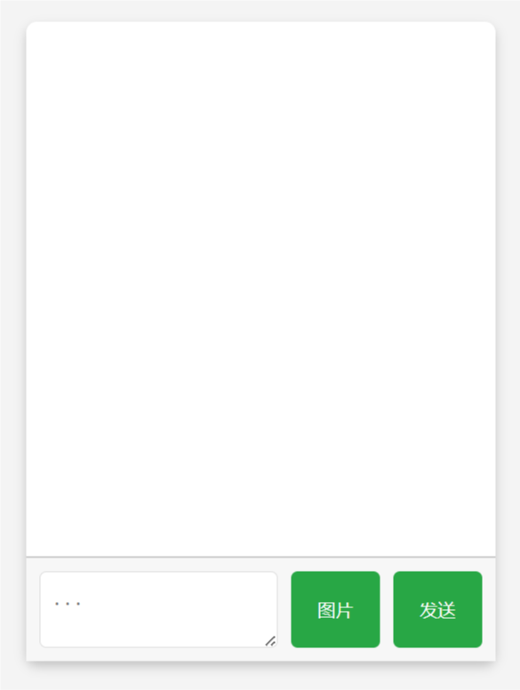

# Just-chat-PWA


**安装必要的软件**
   首先，你需要确保你的VPS上安装了 `Node.js` 和 `npm`。执行以下命令来安装它们：

   ```bash
   sudo apt update
   sudo apt install nodejs npm -y
   ```

   确认安装是否成功：

   ```bash
   node -v
   npm -v
   ```

### 1. **设置项目目录**
   在你的VPS上创建一个新的目录来存放项目文件：

   ```bash
   mkdir my-chat-app
   cd my-chat-app
   ```

### 2. **初始化Node.js项目**
   在项目目录中初始化一个新的Node.js项目：

   ```bash
   npm init -y
   ```

   这会生成一个 `package.json` 文件。

### 3. **安装必要的Node.js包**
   你需要安装 `express` 和 `socket.io` 来处理服务器和实时通信：

   ```bash
   npm install express socket.io multer
   ```

### 4. **创建服务器文件**
   使用 `nano`（或你喜欢的文本编辑器）创建 `server.js` 文件：

   ```bash
   nano server.js
   ```

   将之前提供的 `server.js` 内容粘贴进去。保存并退出（按 `Ctrl + X` 然后按 `Y` 保存）。

### 5. **创建前端文件**
   创建一个 `public` 目录，然后在里面创建 `index.html` 文件：

   ```bash
   mkdir public
   nano public/index.html
   ```

   将之前提供的 `index.html` 内容粘贴进去。保存并退出。

### 6. **启动服务器**
   在项目目录中运行服务器：

   ```bash
   node server.js
   ```

   如果一切正常，你应该会看到 `listening on *:3000` 的提示。

### 7. **访问你的聊天应用**
   打开浏览器，访问 `http://your_server_ip:3000`，你应该能看到你的聊天网页了。

### 8. **（可选）设置服务器自启动**
   你可能希望你的服务器在VPS重启后自动启动。你可以使用 `pm2` 来管理 Node.js 应用：

   ```bash
npm install pm2 -g
pm2 start server.js --name "chat"
pm2 save
pm2 startup
   ```


你遇到的错误通常是由于旧版本的 Node.js 和 npm 导致的。Ubuntu 18.04 默认安装的 Node.js 版本可能较旧，不支持一些最新的 npm 功能。

### 解决步骤：

1. **更新 Node.js 和 npm：**

   你可以使用 NodeSource 的 Node.js 安装脚本来安装最新版本的 Node.js 和 npm。执行以下命令：

   ```bash
   curl -fsSL https://deb.nodesource.com/setup_14.x | sudo -E bash -
   sudo apt-get install -y nodejs
   ```

   上述命令会安装 Node.js 14.x 版本，你也可以选择其他版本（如 `setup_16.x` ）。

2. **验证安装是否成功：**

   安装完成后，检查 Node.js 和 npm 的版本：

   ```bash
   node -v
   npm -v
   ```

   确保 Node.js 的版本为 14.x 或更高，npm 版本为 6.x 或更高。

3. **重新安装所需的包：**

   现在你可以重新运行 `npm install` 命令：

   ```bash
   npm install express socket.io multer
   ```

这应该能解决你遇到的问题。如果在安装过程中仍然遇到问题，请告诉我具体的错误信息。
